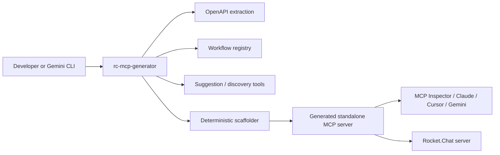
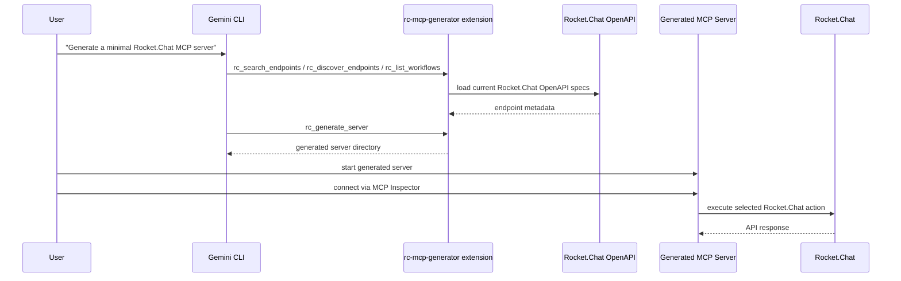

# rc-mcp-generator

`rc-mcp-generator` is a Gemini CLI extension and deterministic TypeScript generator that creates standalone minimal Rocket.Chat MCP servers for only the workflows and API operations a project actually needs.

In one line:

> Instead of shipping one huge Rocket.Chat MCP server with every possible tool, this project generates a small deployable MCP server with only the selected tools, tests, and configuration.

## Why this exists

Rocket.Chat exposes a large API surface. A full MCP server for all of it adds unnecessary tool definitions, schema payload, and context overhead to every agent loop. This project solves that by generating a new MCP server per project, containing only the selected subset of capabilities.

That gives you:

- less context bloat
- fewer irrelevant tools
- lower token waste
- simpler tool selection for agents
- a standalone generated server you can run, inspect, and deploy

## What the MVP proves

This MVP proves both required paths:

1. Direct generator path
- generate a minimal Rocket.Chat MCP server from the CLI
- run the generated server
- connect with MCP Inspector
- execute a real Rocket.Chat action

2. Gemini CLI extension path
- install this repo as a Gemini CLI extension
- let Gemini call discovery/generation tools
- generate a standalone MCP server through Gemini
- run that generated server and execute a real Rocket.Chat action

## What the repo contains

There are two layers in this repo:

- `packages/generator`
  - the main product
  - Gemini CLI extension MCP server over stdio
  - endpoint discovery/search/suggestion
  - deterministic server generation
  - validation and minimality analysis

- `packages/mcp-server`
  - reusable generated-server foundation
  - typed Rocket.Chat client
  - Streamable HTTP MCP server
  - high-level Rocket.Chat workflow tools reused as generation templates

## Architecture

### High-level architecture



### Gemini extension flow



## Generator tools

The extension exposes these MCP tools:

- `rc_list_workflows`
- `rc_search_endpoints`
- `rc_discover_endpoints`
- `rc_suggest_endpoints`
- `rc_generate_server`
- `rc_validate_server`
- `rc_analyze_minimality`

## Included Rocket.Chat workflows

The workflow registry currently includes 10 platform-level operations:

- `send_channel_message`
- `create_project_room`
- `onboard_user`
- `search_messages`
- `archive_project_channel`
- `get_user_mentions`
- `post_standup`
- `create_support_ticket`
- `broadcast_announcement`
- `export_channel_summary`

These are not raw API wrappers. They are higher-level operations built for typical Rocket.Chat project workflows.

## Generated server output

`rc_generate_server` creates a standalone project with:

- `src/server.ts`
- `src/rc-client.ts`
- `src/tools/*.ts`
- `tests/*.test.ts`
- `.env`
- `.env.example`
- `README.md`
- `GEMINI.md`
- `gemini-extension.json`
- `Dockerfile`

The generated server runs over Streamable HTTP and reads:

- `RC_SERVER_URL`
- `RC_AUTH_TOKEN`
- `RC_USER_ID`
- `PORT`
- `ENABLED_TOOLS`

## Quick start

From the repo root:

```bash
cd /home/samar/Projects/rc-mcp-generator
pnpm install
pnpm typecheck
pnpm build
pnpm test
```

## Verification path 1: direct generator CLI

This is the simplest mentor demo.

### 1. Generate a minimal server

From the repo root:

```bash
node packages/generator/dist/cli.js generate \
  --output ./generated/my-server \
  --workflows send_channel_message,post_standup \
  --operation-ids post-api-v1-chat.sendMessage,get-api-v1-chat.search \
  --server-name my-rc-mcp-server \
  --rc-url http://localhost:3000 \
  --rc-auth-token YOUR_REAL_TOKEN \
  --rc-user-id YOUR_REAL_USER_ID
```

### 2. Validate the generated output

```bash
node packages/generator/dist/cli.js validate ./generated/my-server
```

### 3. Build and test the generated server

```bash
cd /home/samar/Projects/rc-mcp-generator/generated/my-server
npm install
npm run build
npm test
```

### 4. Set runtime environment

Edit [generated/my-server/.env](/home/samar/Projects/rc-mcp-generator/generated/my-server/.env):

```env
RC_SERVER_URL=http://localhost:3000
RC_AUTH_TOKEN=YOUR_REAL_TOKEN
RC_USER_ID=YOUR_REAL_USER_ID
ENABLED_TOOLS=
PORT=4000
```

Use `4000` because Rocket.Chat itself usually runs on `3000`.

### 5. Start the generated server

```bash
npm start
```

### 6. Verify health

In another terminal:

```bash
curl http://127.0.0.1:4000/health
```

Expected:

```json
{"ok":true,"service":"rc-mcp-server"}
```

### 7. Connect with MCP Inspector

Open MCP Inspector and configure:

- Transport: `Streamable HTTP`
- URL: `http://localhost:4000/mcp`

Then run `send_channel_message` with:

```json
{
  "channelName": "general",
  "text": "hello from generated my-server"
}
```

Expected result:

- the tool returns success in Inspector
- the message appears in Rocket.Chat `#general`

## Verification path 2: Gemini CLI extension

This proves the "extension/customization of gemini-cli" part.

### 1. Link the extension

From the repo root:

```bash
pnpm build
gemini extensions link .
```

This uses the root manifest at [gemini-extension.json](/home/samar/Projects/rc-mcp-generator/gemini-extension.json).

### 2. Start Gemini CLI

```bash
gemini
```

### 3. Run discovery prompts

Use prompts like:

```text
List the Rocket.Chat workflows available in the rc-mcp-generator extension.
```

```text
Search Rocket.Chat endpoints related to sending messages and searching messages.
```

```text
Discover the Rocket.Chat messaging domain and expand the Chat tag.
```

Expected:

- Gemini calls the extension tools
- Gemini returns workflows, endpoint search results, and expanded endpoint discovery data

### 4. Generate a server through Gemini

Example prompt:

```text
Generate a minimal Rocket.Chat MCP server in ./generated/gemini-server with workflows send_channel_message and post_standup and operationIds post-api-v1-chat.sendMessage,get-api-v1-chat.search. Use Rocket.Chat URL http://localhost:3000, auth token YOUR_REAL_TOKEN, and user ID YOUR_REAL_USER_ID.
```

Expected:

- Gemini calls `rc_generate_server`
- a new folder appears at `generated/gemini-server` or `generated/gemini-server-*`

### 5. Run the Gemini-generated server

From a normal terminal:

```bash
cd /home/samar/Projects/rc-mcp-generator/generated/gemini-server
npm install
npm run build
npm test
```

Edit its `.env` to avoid port conflict:

```env
RC_SERVER_URL=http://localhost:3000
RC_AUTH_TOKEN=YOUR_REAL_TOKEN
RC_USER_ID=YOUR_REAL_USER_ID
ENABLED_TOOLS=
PORT=4001
```

Then start it:

```bash
npm start
```

Verify:

```bash
curl http://127.0.0.1:4001/health
```

Connect MCP Inspector to:

- Transport: `Streamable HTTP`
- URL: `http://localhost:4001/mcp`

Then run `send_channel_message` again.

If the message appears in Rocket.Chat, the Gemini-driven path is proven.

## Runtime requirements

You do not need a custom API key for this project itself.

You do need:

- Gemini CLI installed and authenticated, if testing the Gemini extension path
- Rocket.Chat credentials for the generated server:
  - `RC_SERVER_URL`
  - `RC_AUTH_TOKEN`
  - `RC_USER_ID`

## Current validation status

Workspace checks:

- `pnpm typecheck`
- `pnpm build`
- `pnpm test`

Generated output checks were also verified:

- generated server installs successfully
- generated server builds successfully
- generated server tests pass
- generated server runs over Streamable HTTP
- tool calls succeed against a live local Rocket.Chat instance

## Notes

- The first live generation run fetches Rocket.Chat OpenAPI specs from GitHub.
- Generated `.env` files may default to `PORT=3000`; for local testing, change them to a free port like `4000` or `4001`.
- The `generated/` directory in this repo may contain previous smoke/demo outputs from local verification runs.

## What to share

For a proposal or mentor review, the GitHub repository is the main deliverable.

Recommended package to share:

- GitHub repo link
- short demo video or GIF
- 2 screenshots:
  - MCP Inspector tool call success
  - Rocket.Chat message appearing in the workspace

Hosting is optional for the MVP.

You do not need to host the generator itself to prove the project idea. A clean repo plus a short reproducible demo is enough. If you want extra polish, you can host one generated MCP server later, but that is not necessary to demonstrate the MVP.
